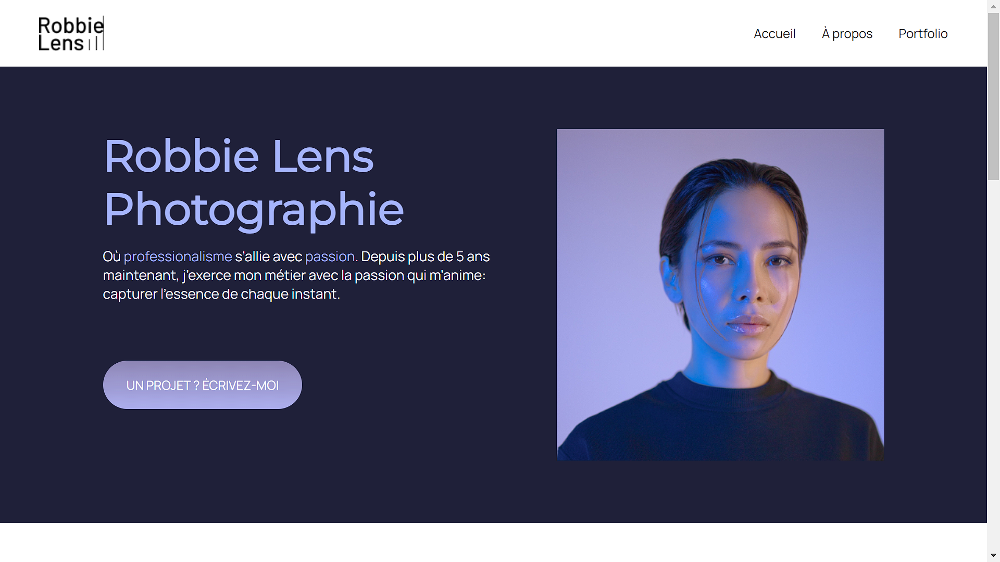

# monPremierProgramme

# Site vitrine - Robbie Lens Photographie

Site vitrine développé en HTML et CSS pour une photographe professionnelle. Ce projet met en lumière son univers artistique, détaille ses services, et valorise son travail à travers une galerie d’images moderne, soignée et responsive.


## 🌐 Aperçu

🔗 [Voir le site en ligne](https://ibrahimaCisse10.github.io/monPremierProgramme/)

  


## 🛠️ Technologies utilisées

- HTML5  
- CSS3

## ✨ Fonctionnalités

- Page d’accueil mettant en valeur l’univers de la photographe
- Galerie d’images adaptative pour tous types d’écrans
- Sections “À propos” et “Portfolio” pour présenter son activité
- Formulaire de contact permettant aux visiteurs d’envoyer un e-mail
- Design simple, moderne et professionnel

## 📦 Installation

1. Clone le dépôt :
   ```bash
   git clone https://github.com/ibrahimaCisse10/monPremierProgramme.git
